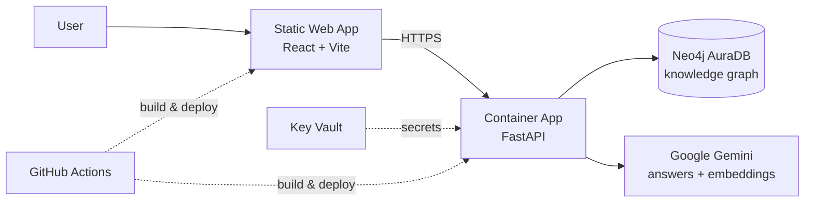

# GraphRAG Explorer

**Ask plain-English questions about a codebase and get answers grounded in its real structure and history — not guesses.**

🔗 **Live demo:** https://brave-grass-004b25000.3.azurestaticapps.net

---

## What it does

Point it at one or more GitHub repositories. It reads the code, the commit
history, and how everything connects — which function calls which, which file
changed in which commit, who wrote it — and stores all of that as a **knowledge
graph** in Neo4j.

Then you can ask things like:

- *"What does `resolve_cross_repo_edges` do, and what calls it?"*
- *"Which files tend to change together?"*
- *"If I change this function in the shared library, what breaks downstream?"*
- *"Which commits touched authentication code, and who wrote them?"*

Each answer is assembled from the graph plus semantic search over the code, then
written up by Google Gemini — with the sources it used.

## Why a graph instead of "just embeddings"

Most code chatbots paste big chunks of files into the prompt and hope the model
connects the dots. This one looks up the *specific* things your question is about
and follows their real relationships.

| | Plain vector RAG | GraphRAG Explorer |
|---|---|---|
| Context sent to the model | Large blobs of nearby code | Just the relevant functions/commits + their direct neighbours |
| Multi-file / multi-repo questions | Often misses the link | Follows real call edges and cross-repo references |
| Cost per question | High (many tokens) | Low (targeted lookup) |
| *"Who introduced this?"* | Can't answer | Traces the commit and author |

## How a question gets answered

1. **Understand it** — an LLM pass extracts what you're asking about (function
   names, files, intent).
2. **Look it up in the graph** — find those nodes, then walk to their direct
   neighbours: callers, callees, the file they live in, recent commits.
3. **Semantic search** — vector search over code and commit embeddings catches
   anything named differently than you phrased it.
4. **Build a tight context** — merge both, capped per node type so the prompt
   stays small.
5. **Answer** — Gemini writes the response and cites the graph and search hits.

## Architecture



The graph runs in two places, switched by a single environment variable
(`NEO4J_URI`):

| Layer | Local development | Cloud (Azure) |
|---|---|---|
| Frontend | Vite dev server | Static Web Apps |
| Backend API | `uvicorn` | Container Apps (autoscale 1–3, HTTPS) |
| Graph database | Neo4j 5 in Docker | Neo4j AuraDB (managed) |
| Secrets | `.env` file | Key Vault |
| Language model | Google Gemini | Google Gemini |

**CI/CD (GitHub Actions).** On every push to `main`: the backend image is built,
pushed to Azure Container Registry, and the Container App is rolled to it; the
frontend is built and deployed to Static Web Apps. Azure auth uses OIDC federated
identity — no cloud passwords are stored anywhere.

## Tech stack

- **Graph:** Neo4j 5 with native vector indexes (3072-dim Gemini embeddings)
- **Backend:** Python, FastAPI, LangChain, Neo4j driver
- **Frontend:** React 19, Vite
- **AI:** Google Gemini — `gemini-2.5-flash` for answers, Gemini embeddings for search
- **Ingestion:** Tree-sitter (AST parsing for Python and Go), PyGitHub
- **Cloud:** Azure Container Apps, Static Web Apps, Container Registry, Key Vault; Neo4j AuraDB
- **CI/CD:** GitHub Actions with OIDC federated identity

## Run it locally

```bash
cp .env.example .env            # add your GITHUB_TOKEN and GOOGLE_API_KEY
docker compose up -d --build    # Neo4j + backend + frontend
open http://localhost:5173
```

Load a repository into the graph:

```bash
# set TARGET_REPO=owner/name in .env, then:
python backend_ingest.py
```

Want just the database? `docker compose up -d neo4j` and run the backend and
frontend however you like. Full cloud deployment steps are in
[`docs/deploy/azure-setup.md`](docs/deploy/azure-setup.md).

## What's in the demo graph

**6 repositories · ~20,000 nodes · ~173,000 relationships**

`aaryaman1221/Ripple` · `aaryaman1221/SecureBank` · `charmbracelet/bubbles` ·
`charmbracelet/lipgloss` · `gohugoio/hugo` · `spf13/cobra`

## Notes from building it

- **Gemini is geo-blocked in some regions.** The Azure backend had to move from
  Hong Kong to Korea Central because Gemini's API refuses requests originating in
  Hong Kong. The frontend stayed put — it never calls Gemini directly.
- **Context budgeting.** Early versions blew the token budget by sending too much
  graph context; there's now a per-node-type cap on how much gets pulled in.
- **Managed identity for CI.** The Azure tenant blocks service-principal
  creation, so GitHub Actions authenticates through a federated credential on a
  user-assigned managed identity instead.
- **Automatic credential fallback.** The backend uses server-side Neo4j
  credentials when a request doesn't carry its own, so the deployed site connects
  with no user input while local development can still point anywhere.

## Repository layout

```
backend/            FastAPI app (app/) + entry point (main.py)
ingest/             GitHub → Neo4j pipeline (AST parsing, embeddings, graph writes)
frontend/           React + Vite chat UI
maintenance/        One-off scripts to repair/upgrade an existing graph
backend_ingest.py   CLI wrapper for the ingestion pipeline
docker-compose.yml  One-command local stack
docs/deploy/        Cloud deployment runbook
.github/workflows/  CI/CD (backend, frontend, AuraDB keep-alive)
```
